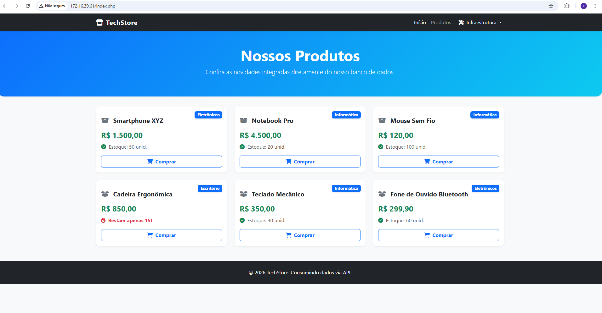
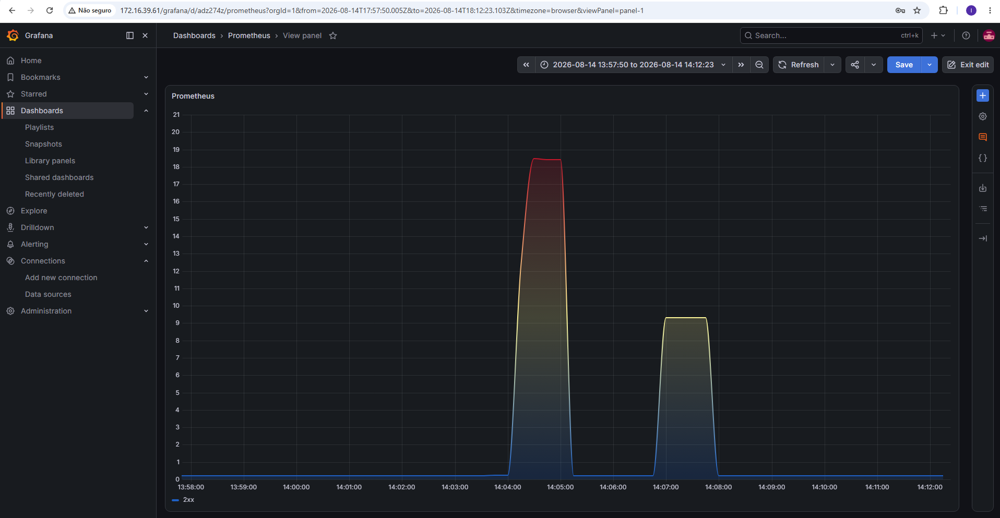

# Documentação do Projeto

Este repositório contém a infraestrutura em contêineres para uma aplicação web com backend em Python (FastAPI), frontend em PHP, banco de dados MySQL, cache em Redis e stack completa de observabilidade (Prometheus e Grafana).

## 1. Setup (Configuração do Ambiente)

### Pré-requisitos
* Docker
* Docker Compose
* Git

### Configuração Inicial
1. Clone o repositório.
2. Na raiz do projeto, crie um arquivo `.env` para definir a variável de ambiente do host, necessária para os links de infraestrutura:
```bash
IP_VM=seu_ip_aqui
```

## 2. Execução

Para iniciar toda a infraestrutura, execute o comando abaixo na raiz do projeto:

```bash
docker compose up -d --build
```

### Acessos do Sistema
* **Frontend (Loja):** `http://<IP_VM>`
* **Painel de Teste de Carga:** `http://<IP_VM>/teste_carga.php`
* **API FastAPI:** `http://<IP_VM>/api/produtos`
* **Grafana:** `http://<IP_VM>/grafana/` (Credenciais padrão: admin / admin)
* **phpMyAdmin:** `http://<IP_VM>/phpmyadmin/`
* **Portainer:** `http://<IP_VM>:9000`

### Prints

1. **Catálogo de Produtos:**



2. **Teste de Carga (Relatório):**


3. **Observabilidade:**



## 3. Troubleshooting (Resolução de Problemas)

* **Caracteres corrompidos no frontend (Problema de Encoding):**
  Se as palavras acentuadas aparecerem desconfiguradas, o problema geralmente ocorre na inicialização do volume do MySQL. 
  Solução: Garanta que os arquivos de dump (`.sql`) possuam o comando `SET NAMES utf8mb4;` na primeira linha. Execute o processo de rollback abaixo e inicie novamente.

* **Prometheus não exibe dados no Grafana ("No Data"):**
  1. Acesse o Grafana, vá em Explore e execute a query `http_requests_total`.
  2. Se retornar vazio, verifique o arquivo `prometheus.yml`. O campo `targets` deve apontar para o nome exato do serviço da API no `docker-compose.yml` (ex: `api:8000`).
  3. Verifique se o contêiner do Prometheus está na mesma rede (`networks`) da API no Docker.

* **Erro "Not Found" ou 404 ao acessar a API pelo Nginx:**
  Verifique o arquivo `nginx/default.conf`. A diretiva `proxy_pass` não deve conter uma barra no final.
  Correto: `proxy_pass http://api:8000;`
  Incorreto: `proxy_pass http://api:8000/;`

## 4. Rollback (Reversão do Ambiente)

Para interromper a execução, destruir os contêineres e apagar os volumes de dados físicos (banco de dados e cache), utilize o comando abaixo. Este procedimento é destrutivo e zera o estado da aplicação.

```bash
docker compose down -v
```

### Automação do Backup (Crontab)

Para agendar a execução automática do script de backup todos os dias, siga o passo a passo no terminal:

1. Dê permissão de execução ao script:
```bash
chmod +x /caminho/completo/ate/o/script/backup-script-mysql.sh
```

2. Ajuste as permissões do diretório para o seu usuário:
```bash
sudo chown -R user_name:user_name /caminho/completo/ate/database
```

3. Abra o editor de tarefas agendadas:
```bash
crontab -e
```

4. Cole a linha abaixo no final do arquivo, salve e feche (de 1 em 1 minuto nesse exemplo):
```bash
* * * * * /caminho/completo/ate/o/script/backup-script-mysql.sh
```